[Home](https://bit.ly/camwritesdocs) | [Stylized Version](https://bit.ly/atextdoc2)

---
# About aText

**What is aText?**  
aText is a text expander tool that lets users automate repetitive aspects of their work by turning frequently used text and images into "Snippets". Users can easily apply Snippets of any length inside a text box by typing a short, user-defined abbreviation. 

**What will this tutorial cover?** 
This beginner level tutorial teaches readers how to navigate and use aText's interface and basic functions. 

---
# Table of Contents

[Overview](#Overview)  
[Groups](#Groups)  
[Snippets](#Snippets)  
[Insert elements](#insert-elements)  
[Back up aText data](#back-up-aText-data)  

---
# Overview
The default aText interface is shown below.  

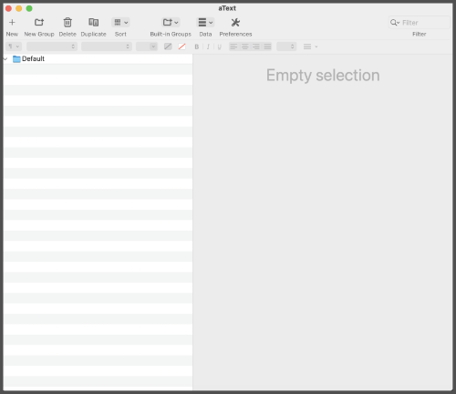  
_**Tip:** aText also allows for toolbar customization and includes a visibility toggle for a more simplified view of the workspace._ 
    

**Main Functions**  
 &nbsp;&nbsp;&nbsp; Create a **New** Snippet  
 &nbsp;&nbsp; Create a **New Group**  
 &nbsp;&nbsp;&nbsp; **Delete** selected Snippet(s) or Group(s)  
 &nbsp; **Duplicate** selected Snippet(s) or Group(s)  
 &nbsp;&nbsp; **Sort** Groups or Snippets  
 &nbsp;&nbsp; Access **Built-In Groups** included with aText  
 &nbsp;&nbsp; Perform various actions with aText **Data**  
 &nbsp;&nbsp; Adjust overall aText **Preferences**  

**Features** 
Look up specific Snippets using the **Filter** search 

Format Snippet contents with the Rich Text Editor toolbar 
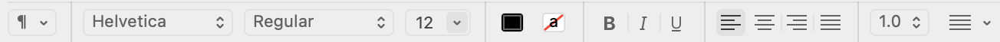

**Main Panels** 
Left: Panel for Groups and Snippets  
Right: Panel for Group Settings and Snippet Content Editor 
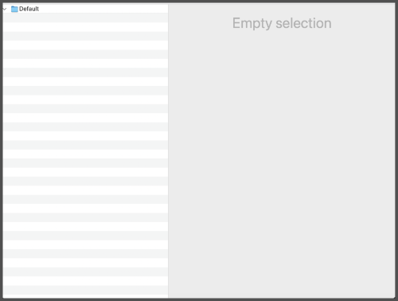
   

**Group settings view:** 
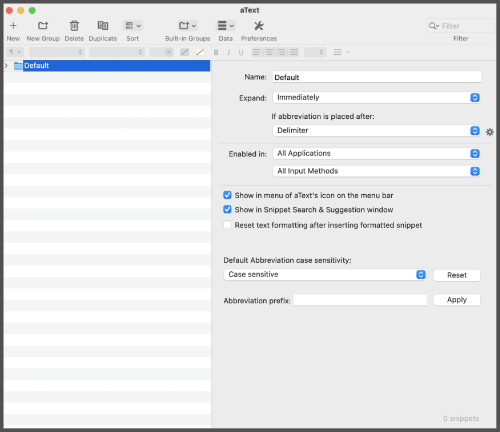
   

**Snippet editor view:** 
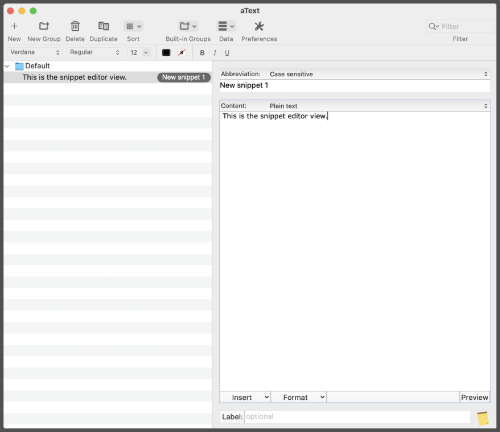

 

[Back to top](#table-of-contents)

---
# Groups

In order to create a Snippet, a user must first create a Group. Groups allow the user to compile, organize, and manage Snippets. While individual Snippets cannot adhere to specific text expansion settings, different Groups can have different text expansion settings.

**Create a new Group** 
1. Click **New Group** 

2. Type the name of the Group in the “**Name**” field

3. Adjust the text expansion settings as needed or take no additional action to accept default settings

 

### Move, sort, and delete Groups
Multiple Groups can be arranged manually or alphabetically by using the **Sort**  function. Groups cannot be nested in other Groups. 

 

**Move an entire Group manually** 
1. Click the folder  next to the Group that will be moved

2. Hold and drag the Group to the desired spot

3. Look for the blue line to indicate the correct placement is selected

4. Release the hold

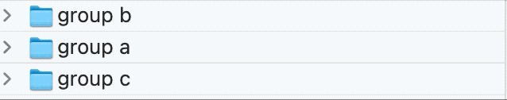
  

**Sort all Groups alphabetically:**  
Click **Sort**  > Select “**Sort Groups alphabetically**”

**Delete a single Group:**  
1. Click the folder  or title of the Group to be deleted 

2. Click **Delete**  

3. Choose “**Delete**” on the popup warning

 

**Delete multiple Groups**  
1. Ensure that each Group to be deleted is sorted back-to-back

2. Click the folder  or title of the top or bottom Group 

3. Hold shift and click on the additional Groups to be deleted

4. Release the shift button 

5. Click **Delete**  
   
6. Choose “**Delete**” on the popup warning
  

[Back to top](#table-of-contents)

---
# Snippets
Snippets are the primary function of aText and support a significant amount of customization. Users can tailor snippets with static text, custom fields, automations, or various combinations of each.
 

>**Note:** A Snippet cannot exist outside of a Group. If there are no Groups when the user chooses to create a new Snippet, a new Group will automatically be generated for the Snippet.

 

**Create a new Snippet**  
1. Click **New** 

2. Create an abbreviation in the "**Abbreviation**" field to the right

3. Adjust the desired abbreviation settings by clicking on the up-down arrows  to the far right

4. Create the Snippet’s content in the content box

_**Optional:**_  

- Adjust the content type using the up-down arrows  to the right of the "**Plain text**" selection

- Apply desired formatting using the Rich Text Editor above or from the "**Format**" drop down menu below

- Click the "**Preview**" button in the bottom right to see a demonstration of the Snippet
  

>**Note:** The default sensitivity will be set to **"Case sensitive"** for each new Snippet. This can be adjusted in the Group’s settings. 
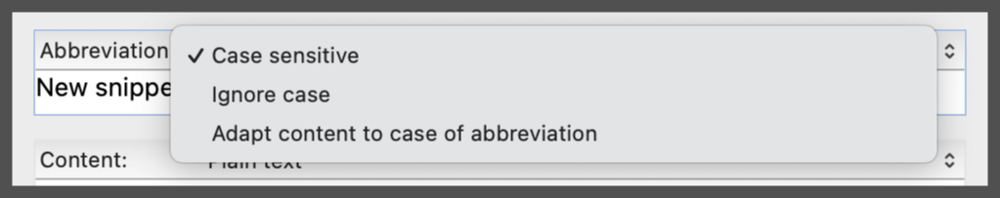  
If a Snippet’s abbreviation is left blank, there will be no way to access the content of the Snippet in a text editor and ultimately disables the specific Snippet.  
If a Snippet’s abbreviation is a duplicate of an existing abbreviation, each duplicated name will appear in a selection box when activated (however, the content of a Snippet can be repeatedly duplicated without issue).  
   
In the Group/Snippet Panel, duplicate Snippet abbreviations are denoted in orange.   
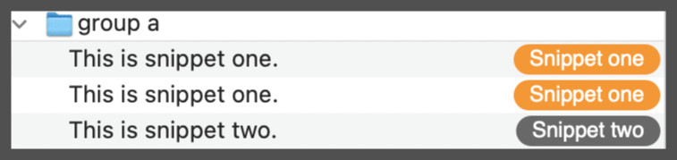
 
 

### Move, sort, and delete Snippets
Like Groups, Snippets can be moved manually. However, there are additional sorting options that can be used to manage Snippets via the **Sort**  function.

 

**Move a single Snippet manually:**   
1. Click and hold the Snippet in the Group/Snippet Panel

2. Drag the Snippet to the desired placement

3. Look for the blue placement line to ensure the correct location is selected

4. Release the hold 

 

_**Tip:** When moving a Snippet into another Group, hold the Snippet over the Group title or folder  for about 2 seconds to auto-expand the Group contents. Once placed, the Snippet will adhere to that Group’s expansion settings._

    

**Sort all Snippets:**

Click **Sort**  > Select desired sorting method  

⚠️ **Warning: Sorting will impact every Snippet, regardless of what Group they are in.** ⚠️  
 

**Delete a single Snippet:**   
1. Click the name of the Snippet to be deleted 

2. Click **Delete** 

3. Choose “**Delete**” on the popup warning
 

**Delete multiple Snippets at once:**   
1. Ensure that each Snippet to be deleted is sorted back-to-back 

2. Click the top or bottom Snippet

3. Hold shift and click on the additional Snippets to be deleted

4. Release the shift button 

5. Click **Delete** 

6. Choose “**Delete**” on the popup warning

 

[Back to top](#table-of-contents)

---
# Insert elements
Users may desire to add additional custom fields or automations to a Snippet in order to maximize its output. Elements from the "**Insert**" menu can either be used as standalone Snippets or to enhance Snippets with static content.

**Add an automated or editable element to a Snippet:**   
1. Create a new Snippet or open an existing Snippet

2. Click the "**Insert**" tab located in the bottom left corner of the Snippet content editor

3. Hover over the expandable menu items to view the available options

 

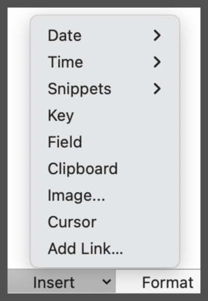
  

**Date** - Various date formats  

**Time** - Various time formats  

**Snippets** - Supports inclusion of simple Snippets into current Snippet   

>**Note:** a Snippet cannot be added to itself.    

**Key** - Allows the user to define a specific key stroke to be triggered upon activating the expander (i.e. automated deleting, screen reading, special characters, etc.)   

**Field** - Various text field options   

**Clipboard** - Inserts last copied clipboard contents   

**Image…** - Inserts selected image(s)   

**Cursor** - Indicates a specific location for the cursor upon activation of the text expansion   

**Add link…** - Hyperlink selected text in Snippet  

>**Note:** Hyperlinking is only available when the Snippet’s content setting is set to “**Formatted text, picture**”.

  
  
### Change the settings of an inserted element
Nearly each element has variables that can be adjusted to customize what the user needs from a particular Snippet. These settings can be accessed by double clicking on the element’s blue bubble in the content box. 

 

**Snippet content with an element added:**  
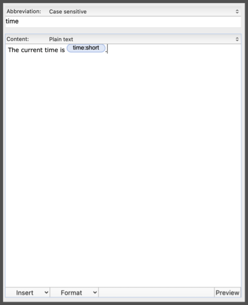
    

**Adjustable variables (shown here: the short format "**Time**" automation):**  
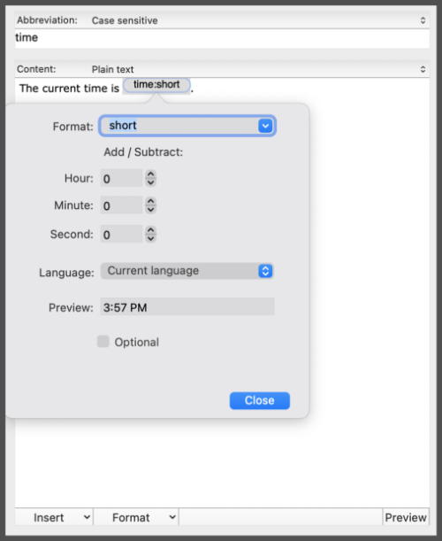
  

**Text expansion preview:** 
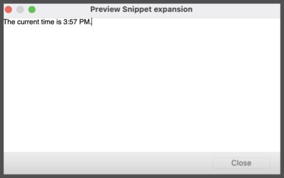

 
  
### Insert multiple elements in one Snippet 
Snippets can be designed to include editable fields within static content. These elements can be included in tandem with automated expanders like time, date, or another Snippet.   

The example below demonstrates how a user might use the "**Time**", several variations of the "**Field**", and "**Cursor**" options to create a simple form. 

 

**Snippet content with several elements added:**  
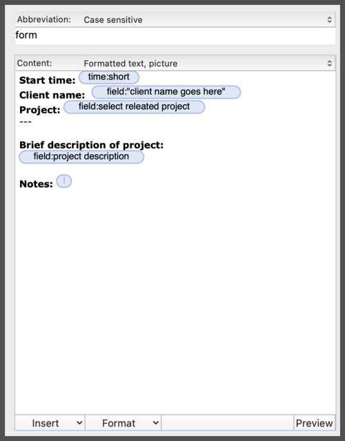
    

**Text expansion preview:**  
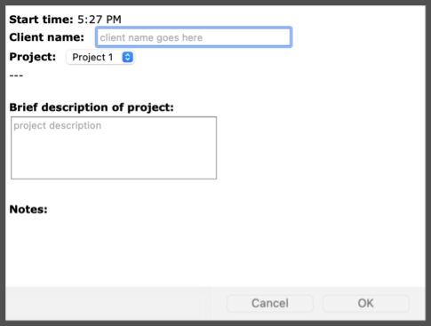
   

**Elements filled out within expansion:**  
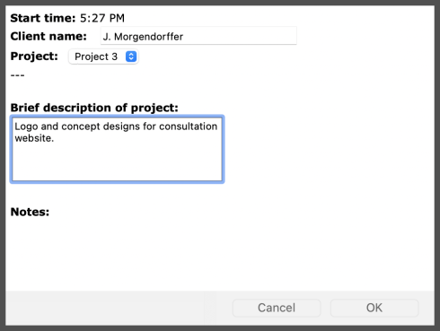
   

**Completed Snippet expansion result:**  
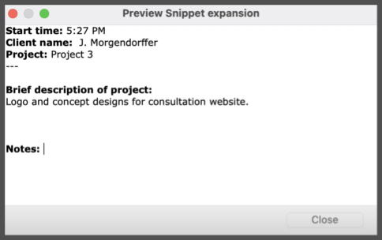

 

[Back to top](#table-of-contents)

---
# Back up aText data
As Snippets are added and customized, a user may wish to keep backups of their overall aText setup. Exporting and importing data also allows users to share their Snippets with others or receive Snippets others have created. 

### Export
There are several ways to export aText data. The best method depends on what the user would like to save, as well as how the user may like to later import their data. 

 

### Save data as an `.atext` file

 

**Backup from Data menu:**  
Click **Data**  > Select “**Backup**” or “**Backup to…**” to name the file and select a specific location 

  

>**Note:** To access backup files, select “**"Restore…"**” from the **Data**  menu. To change the default backup location, open aText’s **Preferences**  and open the “**Backup**” tab.

 

**Save data from the file menu:**  
Click "**File**" > “**"Save…"**” to name and save the file to the desired location 

 

### Save data as a Rich Text Format (RTF) document
When aText data is saved as an RTF, a user will be able to see all Snippets from the selected Groups that were exported. This allows users to conduct a word or phrase search within the entirety of the Snippets. 
    

**Export all Groups to an RTF document**:   
Click **Data**  > Select "**Export All Groups to RTF document…**” to name and save the file to the desired location  

⚠️ **Warning: RTF files cannot be imported back into aText unless done so manually.** ⚠️ 
   

**Export individual and specific Groups:**   
1. Ensure that each Group to be exported is sorted back-to-back 

2. Click the folder icon or title of the top or bottom Group 

3. Hold shift and click on the additional Groups to be exported

4. Release the shift button 

5. Click **Data**  

6. Select “**Export Group to RTF document…**”

7. Name and save the file to the desired location

 

### Import
Another user may choose to share an `.atext` file with someone who would like to add the Snippets inside it to their own collection. This can be accomplished using one of two import methods.

 

**Import from aText:**
  
1. Click **Data**  

2. Select “**Import Data…**”

3. Locate the desired `.atext` file and click "**Open**"

 

**Import directly from an aText file:**  
Double click the `.atext` file > Determine whether to “**Import**” the file (add to existing data) or “**Restore**” the file (replace existing data)

 

[Back to top](#table-of-contents)

---
